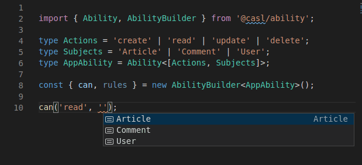
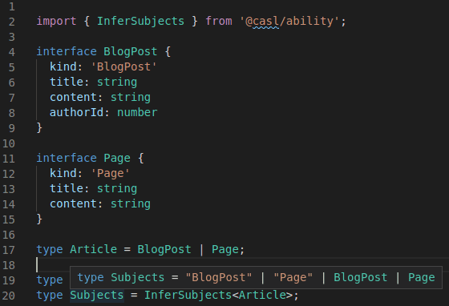
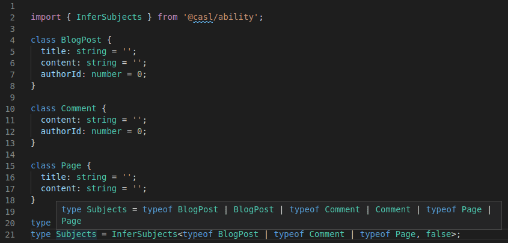
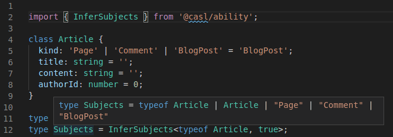
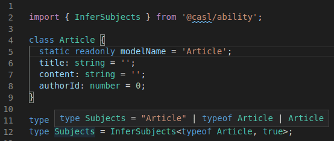

CASL is written in [TypeScript] and this brings several benefits:
* better safety as you can control what actions and subjects can be used
* better IDE integration as you can get hints on what classes you can use and arguments you need to pass inside
* easier library support, we can forgot about synchronization issues between `.d.ts` and `.js` files

[TypeScript]: https://typescriptlang.org/

So, let's play around with them

## Permissions inference

`Ability` class accepts 2 generic parameters:

```ts
import { Ability, Subject, MongoQuery } from '@casl/ability';

type PossibleAbilities = string | [string, Subject];
type Conditions = MongoQuery;

const ability = new Ability<PossibleAbilities, Conditions>();
```

> `Subject` is a special type that represents all possible subjects that `Ability` can accept. So, it's `object | string | Function | undefined`.

Don't be scared by the complexity, `Ability` uses that types by default, so the example above is the same as the one below:

```ts
import { Ability } from '@casl/ability';

const ability = new Ability();
```

These types are enough to protect you from passing from arguments but you can go further and make them even stricter. To illustrate how, let's consider a blog application, which has `User`, `Article` and `Comment` entities with the next permissions:

* can `create`, `update`, `delete` own `Article` or `Comment`
* can `read` any `Article`, any `Comment` and any `User`

So, let's translate this to CASL by specifying all possible actions and all possible subjects as generic parameters:

```ts
import { Ability } from '@casl/ability';

type Actions = 'create' | 'read' | 'update' | 'delete';
type Subjects = 'Article' | 'Comment' | 'User';

const ability = new Ability<[Actions, Subjects]>();
```

If you try to type `ability.can(` in [VSCode] (it should work in other IDEs that support TypeScript) it will suggest possible arguments:

[VSCode]: https://code.visualstudio.com/


The same happens when you try to specify the 2nd argument:


The same behavior works for `AbilityBuilder` and `defineAbility` functions as well:



## Infer subject types from interfaces and classes

You can also specify interfaces as subjects:

```ts
import { Ability } from '@casl/ability';

interface Article {
  id: number
  title: string
  content: string
  authorId: number
}

interface User {
  id: number
  name: string
}

interface Comment {
  id: number
  content: string
  authorId: number
}

type Action = 'create' | 'read' | 'update' | 'delete';
type Subject = Article | Comment | User | 'Article' | 'User' | 'Comment';

const ability = new Ability<[Action, Subject]>();

ability.can('read', 'Article');
ability.can('write', 'Article'); // error because non-existing action name
ability.can('update', 'Coment') // error because of typo
```

and classes:

```ts
import { Ability } from '@casl/ability';

class Article {
  id: number
  title: string
  content: string
  authorId: number
}

type Action = 'create' | 'read' | 'update' | 'delete';
type Subject = typeof Article | Article;

const ability = new Ability<[Action, Subject]>();

ability.can('read', Article);
ability.can('update', new Article());
```

This may be a bit routine to specify all possible subject types, especially if you have more than 3 of them. To make it easier, CASL provide `InferSubjects` typescript helper which can infer subjects from [tagged union]s (this helper checks `kind` and special `__caslSubjectType__` properties in order to determine the tag)

[tagged union]: https://www.typescriptlang.org/docs/handbook/advanced-types.html#discriminated-unions

> `__caslSubjectType__` is set by `subject` helper, to learn more check [Subject type detection](../../guide/subject-type-detection)



classes



and even discriminated classes (you need to pass `true` to the 2nd generic parameter of `InferSubjects`).



The same parameter allows to infer `modelName` static property from classes (in case you want to use strings and not classes to check on subject type)



Moreover, the same behavior also works in complementary packages! So, you will get hints for React's `Can` component, Vue's `$can` function, Mongoose's plugins and others.

> To learn more, read about the complementary package for your framework

But even this is not the end and you can go even further!

## Safer permissions inference

For the most cases the suggested approach above should be enough but if you prefer to ensure extreme type safety, you can define dependencies between actions and subjects. For example, user can only read information about users in your app and nothing more but can manage articles:

```ts
import { Ability } from '@casl/ability';

type CRUD = 'create' | 'read' | 'update' | 'delete';
type Abilities = ['read', 'User'] | [CRUD, 'Article'];

const ability = new Ability<Abilities>();

ability.can('read', 'User');
ability.can('create', 'User'); // build time error! because it's not allowed to create users
```
